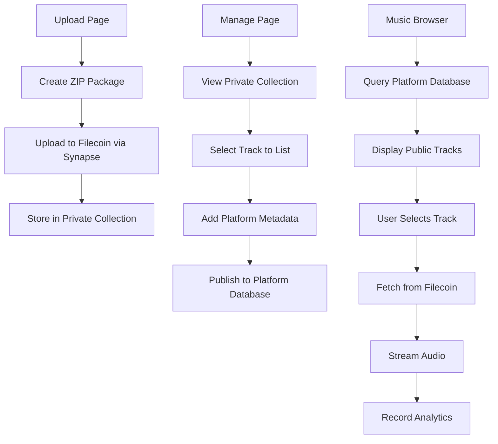

# Design Document

## Overview

The Music Streaming Completion design implements a complete music platform with a two-step process:

1. **Upload Page**: Users upload music packages to Filecoin (already working)
2. **Manage Page**: Users can list their private uploads to the public platform (needs implementation)

This separation allows artists to upload content privately first, then selectively publish tracks to the platform. The system will use Supabase as the database provider for public listings while maintaining Filecoin as the primary storage layer.

The architecture follows: **Filecoin for storage + Private collection management + Public platform database + Streaming interface**.

## Architecture

### High-Level Architecture



### Data Flow

1. **Upload Flow**: ZIP creation → Filecoin storage → Store in user's private collection
2. **Listing Flow**: User selects from private collection → Add metadata → Publish to platform database
3. **Discovery Flow**: Database query → Results display → User selection
4. **Streaming Flow**: Filecoin retrieval → Audio streaming → Analytics recording
5. **Analytics Flow**: Play events → Database aggregation → Dashboard display

## Components and Interfaces

### Database Schema (Supabase)

```sql
-- Music submissions table
CREATE TABLE music_submissions (
    id UUID PRIMARY KEY DEFAULT gen_random_uuid(),
    piece_cid TEXT NOT NULL UNIQUE, -- Filecoin CID
    track_name TEXT NOT NULL,
    artist_name TEXT NOT NULL,
    artist_address TEXT NOT NULL, -- Wallet address
    album TEXT,
    category TEXT,
    duration INTEGER, -- seconds
    cover_photo_url TEXT,
    gradient_colors JSONB, -- {from: string, to: string}
    description TEXT,
    lyrics TEXT,
    release_date DATE,
    created_at TIMESTAMP WITH TIME ZONE DEFAULT NOW(),
    updated_at TIMESTAMP WITH TIME ZONE DEFAULT NOW()
);

-- Play statistics table
CREATE TABLE play_stats (
    id UUID PRIMARY KEY DEFAULT gen_random_uuid(),
    music_id UUID REFERENCES music_submissions(id) ON DELETE CASCADE,
    listener_address TEXT, -- Optional for anonymous plays
    played_at TIMESTAMP WITH TIME ZONE DEFAULT NOW(),
    play_duration INTEGER, -- seconds actually played
    created_at TIMESTAMP WITH TIME ZONE DEFAULT NOW()
);

-- Like statistics table
CREATE TABLE like_stats (
    id UUID PRIMARY KEY DEFAULT gen_random_uuid(),
    music_id UUID REFERENCES music_submissions(id) ON DELETE CASCADE,
    liker_address TEXT NOT NULL,
    created_at TIMESTAMP WITH TIME ZONE DEFAULT NOW(),
    UNIQUE(music_id, liker_address) -- Prevent duplicate likes
);

-- Platform users table
CREATE TABLE platform_users (
    id UUID PRIMARY KEY DEFAULT gen_random_uuid(),
    wallet_address TEXT NOT NULL UNIQUE,
    username TEXT,
    avatar_url TEXT,
    first_seen TIMESTAMP WITH TIME ZONE DEFAULT NOW(),
    last_active TIMESTAMP WITH TIME ZONE DEFAULT NOW(),
    created_at TIMESTAMP WITH TIME ZONE DEFAULT NOW()
);

-- Indexes for performance
CREATE INDEX idx_music_artist_address ON music_submissions(artist_address);
CREATE INDEX idx_music_category ON music_submissions(category);
CREATE INDEX idx_music_created_at ON music_submissions(created_at DESC);
CREATE INDEX idx_play_stats_music_id ON play_stats(music_id);
CREATE INDEX idx_play_stats_played_at ON play_stats(played_at DESC);
CREATE INDEX idx_like_stats_music_id ON like_stats(music_id);
```

### API Endpoints

#### Music Management APIs

```typescript
// POST /api/music/submit
interface SubmitMusicRequest {
  piece_cid: string;
  metadata: {
    track_name: string;
    artist_name: string;
    album?: string;
    category?: string;
    duration?: number;
    description?: string;
    lyrics?: string;
    release_date?: string;
    gradient_colors?: { from: string; to: string };
  };
  cover_photo_url?: string;
}

// GET /api/music/browse
interface BrowseMusicQuery {
  page?: number;
  limit?: number;
  search?: string;
  category?: string;
  artist_address?: string;
  sort_by?: 'created_at' | 'track_name' | 'artist_name' | 'plays';
  sort_order?: 'asc' | 'desc';
}

// GET /api/music/[id]
interface MusicDetailsResponse extends MusicSubmission {
  total_plays: number;
  total_likes: number;
  unique_listeners: number;
}
```

#### Analytics APIs

```typescript
// POST /api/analytics/play
interface RecordPlayRequest {
  music_id: string;
  listener_address?: string;
  play_duration?: number;
}

// POST /api/analytics/like
interface RecordLikeRequest {
  music_id: string;
  liker_address: string;
}

// GET /api/analytics/artist/[address]
interface ArtistAnalyticsResponse {
  artist_address: string;
  artist_name: string;
  total_tracks: number;
  total_plays: number;
  total_likes: number;
  unique_listeners: number;
  tracks: MusicAnalytics[];
}
```

### Frontend Components

#### Enhanced Upload Hook

```typescript
// hooks/useMusicUpload.ts - Enhanced version
export function useMusicUpload() {
  const uploadMusicPackage = async (formData: MusicFormData, password?: string) => {
    try {
      // 1. Create and upload ZIP to Filecoin
      const zipFile = await createMusicZip(formData);
      const uploadResult = await uploadFileMutation.mutateAsync(zipFile);
      
      // 2. Extract metadata and submit to database
      const metadata = extractMetadataFromForm(formData);
      const submitResult = await submitMusicMetadata({
        piece_cid: uploadResult.pieceCid,
        metadata,
        cover_photo_url: await uploadCoverImage(formData.coverImage)
      });
      
      // 3. Return combined result
      return { ...uploadResult, music_id: submitResult.id };
    } catch (error) {
      // Handle partial failures gracefully
      throw error;
    }
  };
}
```

#### Music Browser Components

```typescript
// components/browse/MusicBrowser.tsx
export function MusicBrowser() {
  const { data: tracks, isLoading } = useMusicQuery({
    search: searchQuery,
    category: selectedCategory,
    sort_by: sortBy
  });
  
  return (
    <div>
      <SearchBar onSearch={setSearchQuery} />
      <CategoryFilter onSelect={setSelectedCategory} />
      <TrackGrid tracks={tracks} onPlay={handlePlay} />
    </div>
  );
}
```

#### Music Player Integration

```typescript
// components/player/MusicPlayer.tsx
export function MusicPlayer({ track }: { track: MusicSubmission }) {
  const { audioUrl, isLoading } = useFilecoinAudio(track.piece_cid);
  const { recordPlay } = useAnalytics();
  
  const handlePlay = () => {
    recordPlay({
      music_id: track.id,
      listener_address: address
    });
  };
  
  return (
    <audio
      src={audioUrl}
      onPlay={handlePlay}
      onTimeUpdate={handleProgress}
      controls
    />
  );
}
```

## Data Models

### Core Data Types

```typescript
// Enhanced types based on database schema
export interface MusicSubmission {
  id: string;
  piece_cid: string;
  track_name: string;
  artist_name: string;
  artist_address: string;
  album?: string;
  category?: string;
  duration?: number;
  cover_photo_url?: string;
  gradient_colors?: {
    from: string;
    to: string;
  };
  description?: string;
  lyrics?: string;
  release_date?: string;
  created_at: string;
  updated_at: string;
}

export interface MusicAnalytics extends MusicSubmission {
  total_plays: number;
  total_likes: number;
  unique_listeners: number;
  plays_today: number;
  plays_week: number;
  plays_month: number;
}

export interface PlayEvent {
  id: string;
  music_id: string;
  listener_address?: string;
  played_at: string;
  play_duration?: number;
}
```

### Filecoin Integration Types

```typescript
// Types for Filecoin data extraction
export interface FilecoinMusicPackage {
  audio: {
    name: string;
    size: number;
    url: string;
  };
  cover: {
    name: string;
    size: number;
    url: string;
  };
  metadata: {
    track_name: string;
    artist_name: string;
    album?: string;
    category?: string;
    description?: string;
    lyrics?: string;
    release_date?: string;
    gradient_colors?: { from: string; to: string };
  };
  video?: {
    name: string;
    size: number;
    url: string;
  };
}
```

## Error Handling

### Upload Error Recovery

```typescript
// Error handling strategy for upload failures
export class MusicUploadError extends Error {
  constructor(
    message: string,
    public stage: 'zip_creation' | 'filecoin_upload' | 'metadata_extraction' | 'database_storage',
    public recoverable: boolean = false
  ) {
    super(message);
  }
}

// Recovery mechanisms
export function handleUploadError(error: MusicUploadError) {
  switch (error.stage) {
    case 'filecoin_upload':
      // Retry with exponential backoff
      return retryFilecoinUpload();
    case 'database_storage':
      // Retry database operation without re-uploading
      return retryDatabaseStorage();
    default:
      throw error;
  }
}
```

### Streaming Error Handling

```typescript
// Graceful degradation for streaming issues
export function useFilecoinAudio(piece_cid: string) {
  const [audioUrl, setAudioUrl] = useState<string | null>(null);
  const [error, setError] = useState<string | null>(null);
  
  useEffect(() => {
    const fetchAudio = async () => {
      try {
        // Primary: Direct Filecoin retrieval
        const url = await retrieveFromFilecoin(piece_cid);
        setAudioUrl(url);
      } catch (primaryError) {
        try {
          // Fallback: CDN cache if available
          const cachedUrl = await retrieveFromCDN(piece_cid);
          setAudioUrl(cachedUrl);
        } catch (fallbackError) {
          setError('Unable to load audio');
        }
      }
    };
    
    fetchAudio();
  }, [piece_cid]);
  
  return { audioUrl, error, isLoading: !audioUrl && !error };
}
```

## Testing Strategy

### Unit Tests

```typescript
// Test database operations
describe('Music Metadata Storage', () => {
  test('should store music metadata after Filecoin upload', async () => {
    const mockMetadata = createMockMetadata();
    const result = await submitMusicMetadata(mockMetadata);
    expect(result.id).toBeDefined();
    expect(result.piece_cid).toBe(mockMetadata.piece_cid);
  });
});

// Test API endpoints
describe('Music Browse API', () => {
  test('should return paginated music results', async () => {
    const response = await fetch('/api/music/browse?page=1&limit=10');
    const data = await response.json();
    expect(data.tracks).toHaveLength(10);
    expect(data.pagination).toBeDefined();
  });
});
```

### Integration Tests

```typescript
// Test complete upload flow
describe('Complete Upload Flow', () => {
  test('should upload to Filecoin and store metadata', async () => {
    const formData = createMockFormData();
    const result = await uploadMusicPackage(formData);
    
    // Verify Filecoin upload
    expect(result.pieceCid).toBeDefined();
    
    // Verify database storage
    const dbRecord = await getMusicSubmission(result.music_id);
    expect(dbRecord.piece_cid).toBe(result.pieceCid);
  });
});
```

### Performance Tests

```typescript
// Test query performance
describe('Database Performance', () => {
  test('should handle large result sets efficiently', async () => {
    const startTime = Date.now();
    const results = await browseMusic({ limit: 1000 });
    const duration = Date.now() - startTime;
    
    expect(duration).toBeLessThan(1000); // Under 1 second
    expect(results.tracks).toHaveLength(1000);
  });
});
```

## Implementation Phases

### Phase 1: Database Setup and Basic APIs
- Set up Supabase database with schema
- Implement basic CRUD operations
- Create music submission API endpoint
- Test database connectivity

### Phase 2: Upload Flow Integration
- Enhance useMusicUpload hook
- Add metadata extraction from ZIP files
- Implement automatic database storage after Filecoin upload
- Add error handling and recovery

### Phase 3: Music Discovery and Browsing
- Implement browse/search API endpoints
- Create music browser components
- Add filtering and sorting functionality
- Implement pagination

### Phase 4: Streaming and Analytics
- Integrate Filecoin audio retrieval
- Implement music player with analytics
- Add play/like tracking
- Create artist analytics dashboard

### Phase 5: Performance and Polish
- Add database indexes and query optimization
- Implement caching strategies
- Add comprehensive error handling
- Performance testing and optimization